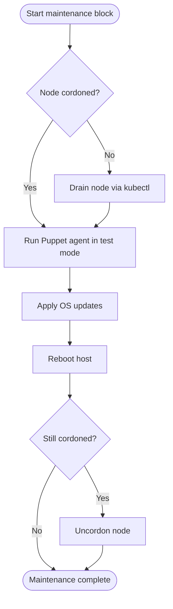

# Maintenance Playbook Reference

The `playbooks/maintenance.yml` file is the primary entry point for scheduled upkeep of the RKE2 clusters. A single play now targets all maintenance hosts and leans on the inventory hierarchy to keep control-plane and worker execution easy to understand. The heavy lifting lives in the shared [`roles/rke2`](../roles/rke2) role so the upgrade and maintenance workflows stay in sync.

## Execution order

1. **Target group:** The play runs against `kube_nodes`, an aggregate that includes the global `kube_control_plane` and `kube_workers` groups. Each of those children exposes the `kube_node_is_control_plane` fact so role-specific tasks can branch when needed.
2. **Ordering:** `order: inventory` preserves the inventory ordering of the aggregate groups. Because the `kube_nodes` group lists `kube_control_plane` before `kube_workers`, all control-plane hosts complete first, followed by their worker counterparts.
3. **Serial maintenance:** With `serial: 1` the workflow finishes on one host before advancing to the next, matching the original behaviour while avoiding duplicate plays.

The kubectl role's setup helpers continue to probe the inventory-defined control-plane group to select a healthy delegate for Kubernetes commands. Control-plane hosts already ship with a kubeconfig, while worker nodes rely on the delegate fact populated during that setup stage.

## Task sequence

The `rke2` role keeps the maintenance pipeline in [`roles/rke2/tasks/maintenance.yml`](../roles/rke2/tasks/maintenance.yml) so every playbook can reuse the same logic. The tasks execute the following steps:

1. **Check cordon status** – Captures whether the node is already cordoned to avoid double-draining.
2. **Drain if required** – Runs `kubectl drain` only when the node was schedulable.
3. **Puppet maintenance** – Imports [`common/puppet_agent.yml`](../playbooks/tasks/common/puppet_agent.yml) to run the Puppet agent in test mode and fail on unexpected issues.
4. **OS updates** – Imports [`common/dnf_update.yml`](../playbooks/tasks/common/dnf_update.yml) to upgrade packages when updates are available.
5. **Reboot** – Imports [`common/reboot.yml`](../playbooks/tasks/common/reboot.yml) to restart the host and wait for it to come back online.
6. **Post-maintenance cordon check** – Confirms whether the node is still cordoned.
7. **Uncordon if needed** – Runs `kubectl uncordon` when the previous check reports that the node remains unschedulable.

Each Kubernetes interaction shells out to `kubectl` on the shared delegate host selected during the kubectl setup stage, matching the behaviour administrators expect from manual maintenance. Because the upgrade playbook uses the same role, any new safeguards or cordon-handling tweaks automatically apply to both entry points.

### Visual flow reference

Mermaid diagrams render natively on GitHub and keep the sequential structure obvious without scrolling through task YAML.

Because the play runs with `serial: 1`, the tasks above repeat for one node at a time. The following timeline shows how control-plane nodes finish before the workers when the default inventory ordering is preserved:

```mermaid
gantt
    dateFormat  X
    title  Serial maintenance execution
    section Control-plane node A
    Drain           :a1, 0, 1
    Puppet          :a2, 1, 1
    Updates         :a3, 2, 1
    Reboot          :a4, 3, 1
    Uncordon/check  :a5, 4, 1
    section Control-plane node B
    Drain           :b1, 5, 1
    Puppet          :b2, 6, 1
    Updates         :b3, 7, 1
    Reboot          :b4, 8, 1
    Uncordon/check  :b5, 9, 1
    section Worker nodes (repeat)
    Drain           :c1, 10, 1
    Puppet          :c2, 11, 1
    Updates         :c3, 12, 1
    Reboot          :c4, 13, 1
    Uncordon/check  :c5, 14, 1
```

Adjust the number of nodes or duration blocks to match your environment when presenting the diagram to stakeholders.

> **Delegation note:** RKE2 worker nodes do not ship with `kubectl` or a KUBECONFIG. The kubectl role
> includes the `tasks/common/select_kubectl_delegate.yml` helper, which chooses the first healthy
> control-plane host and shares it via the `kube_kubectl_delegate` fact so every node can delegate
> Kubernetes commands consistently.

## Extending the workflow

- Add new steps to the maintenance block in `roles/rke2/tasks/maintenance.yml` so every host role continues to share the same maintenance pipeline.
- For optional steps, prefer wrapping the included tasks in `block` statements with clear conditionals so the behaviour remains discoverable.
- When a new maintenance action requires additional variables, document them in the task file and consider providing defaults in `group_vars`.

Keeping the main playbook compact and delegating the implementation to a shared task file preserves readability while making it straightforward to add new capabilities.

## Troubleshooting stuck drains

`kubectl drain` can wait indefinitely when pods refuse eviction. The playbook now exposes several variables to tune that behaviour:

- `kube_drain_include_daemonsets` (default: `false`) – When set to `true` the command renders `--ignore-daemonsets=false`, which forces the drain to wait for daemonset-managed pods. Because daemonsets are typically recreated immediately, the drain will appear to hang unless the daemonset is scaled to zero first.
- `kube_drain_delete_emptydir_data` (default: `true`) – Enables `--delete-emptydir-data` so pods using `emptyDir` volumes are terminated instead of blocking the drain.
- `kube_drain_timeout` (default: `10m`) – Maps to the native `--timeout` flag on `kubectl drain` to abort the operation when the grace period expires. The timeout must include a unit (e.g. `5m`, `30s`).
When a drain times out or hangs, take the following recovery steps:

1. Inspect which pods are blocking the drain with `kubectl get pods -A --field-selector spec.nodeName=<node> -o wide`. Daemonset pods must be deleted by scaling the owning daemonset to zero or by temporarily disabling the drain option that includes them.
2. Check for pod disruption budgets (`kubectl get pdb -A`) that may prevent voluntary disruption. Temporarily raise their `maxUnavailable` or delete them while maintenance is in progress.
3. If the playbook aborted midway, run `kubectl uncordon <node>` to restore scheduling and return the cluster to a healthy state before retrying.
4. After resolving the blockers, rerun the maintenance play. The drain task will respect the configured timeouts and fail fast when pods are still preventing eviction, allowing manual intervention without leaving the node cordoned indefinitely.

## Troubleshooting Cilium networking

`cilium` and `hubble` CLI utilities ship with the maintenance hosts, so you can collect rich dataplane diagnostics without leaving the playbook environment:

- Start by checking the overall health of the dataplane:
  - `cilium status --wait` confirms that the agents, operator, and clustermesh components are healthy before you dig deeper.
  - `cilium status --verbose` surfaces component-level warnings (e.g. failing controllers) that can explain intermittent behaviour.
- Inspect connectivity flows with Hubble:
  - `hubble status` validates that relay and UI instances are reachable.
  - `hubble observe --from-pod <ns>/<pod> --follow` streams live flows from a problematic workload so you can spot drops or policy denies in real time.
  - `hubble observe --protocol l7 --last 20` provides the latest layer-7 transactions and is useful when HTTP/gRPC requests appear to hang.
- Capture a point-in-time snapshot with `cilium sysdump --output ./cilium-sysdump-$(date +%s)` so the networking team can review logs, policy state, and BPF maps offline.
- Verify CNI-critical Kubernetes objects:
  - `kubectl -n kube-system get pods -l k8s-app=cilium` ensures all Cilium agents are running and restarts haven't introduced churn.
  - `kubectl -n kube-system get configmap cilium-config -o yaml` confirms no unexpected configuration drift is forcing the agents into a bad state.

When you open an incident or escalate to the networking team, include the `cilium status` output, any `hubble observe` snippets that show packet drops, and the sysdump archive to accelerate triage.

## Troubleshooting Envoy Gateway

Use `kubectl` plus the Envoy Gateway CRDs to spot routing problems quickly:

- Confirm the managed gateway is healthy:
  - `kubectl -n kube-system get gateways.gateway.networking.k8s.io gw-default -o yaml` reveals status conditions and listener readiness for the `gw-default` instance.
  - `kubectl -n kube-system describe gateway gw-default` highlights any attached events such as certificate or deployment failures.
- Review all managed routes:
  - `kubectl get httproutes.gateway.networking.k8s.io -A -o wide` lists every HTTPRoute with their parentRefs so you can see which ones bind to `gw-default`.
  - `kubectl describe httproute.gateway.networking.k8s.io <namespace>/<name>` provides per-route condition statuses and backend errors when traffic is misrouted.
- Inspect supporting deployments:
  - `kubectl -n envoy-gateway-system get pods` (or your chosen namespace) makes sure the Envoy Gateway controller and data plane pods are running.
  - `kubectl -n envoy-gateway-system logs deploy/envoy-gateway --tail=200` catches reconciliation failures when Gateway API resources refuse to program the dataplane.
- For TLS issues, verify referenced secrets exist and are readable: `kubectl -n <route-namespace> get secret <tls-secret>`.

Capture the gateway status output, relevant HTTPRoute descriptions, and recent controller logs when escalating. They provide enough context for the ingress team to reproduce and resolve the misconfiguration.
